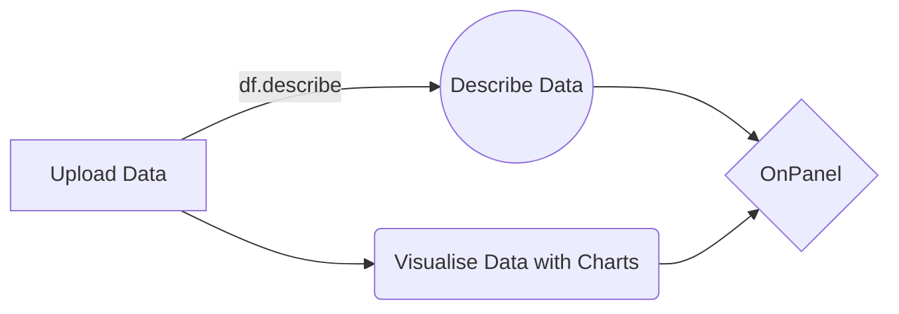

# Welcome to Onpanel

Welcome to the official GitHub repository of OnPanel! OnPanel is a powerful data visualization tool that allows you to describe and visualize your data with ease. Best of all, it's completely free to use!

# Demo
you can use [web app](https://py.onwebs.ir)
you can see demo [OnPanel ](https://onwebsdash.iran.liara.run/) 

## Feathers 

1.  **Data Description**: OnPanel simplifies the process of understanding your data by providing descriptive statistics and insights. Gain a comprehensive overview of your dataset, including measures of central tendency, dispersion, and distribution.
    
2.  **Data Visualization**: Transform your data into visually appealing charts and graphs. OnPanel offers a wide range of visualization options, including scatter plots, line charts, bar graphs, and more. Customize your visuals to suit your needs and enhance your data analysis.
    
    
3.  **User-Friendly Interface**: OnPanel is designed with simplicity in mind. The intuitive interface allows users of all skill levels to navigate and utilize the tool effortlessly. Spend less time configuring and more time analyzing your data.
    
4.  **Collaboration and Sharing**: Collaborate with your team by sharing visualizations and analyses effortlessly. OnPanel provides easy sharing options, allowing you to work together and communicate insights effectively.
## Getting Started
To get started with OnPanel, follow these steps:
1.  Open web application from [here](https://py.onwebs.ir) or open https://py.onwebs.ir in your browser.
2. Click on Login to Panel in access widget

## Flow Chart

## Documents

You can read documentation following this link:
https://onwebs.ir/main/onpanel

## Pics

[![][banner-url]]  

[banner-url]: https://onwebs.ir/main/wp-content/uploads/2023/08/40cc958c-tmplw-wpdev-saas-template-1-mac.png
